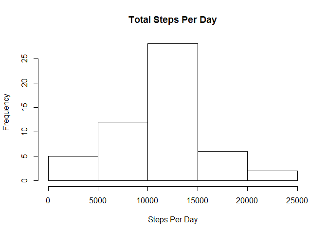
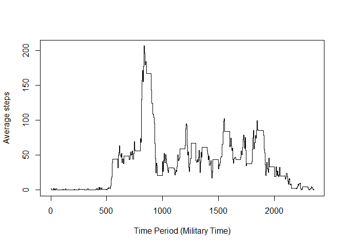
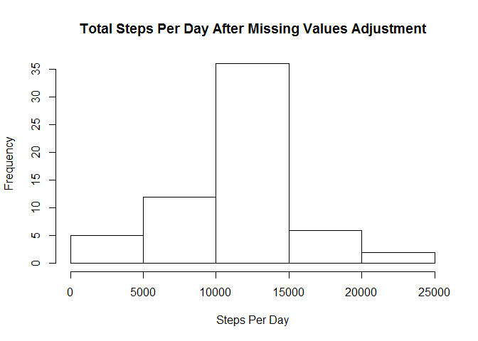
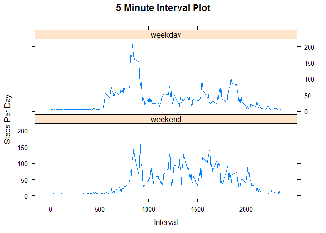

# Reproducible Research: Peer Assessment 1

    Load R libraries

```r
    library(plyr)
    library(lattice)
```

## 1. Code For Reading In The Dataset And Processing Data
### Loading and preprocessing the data
Code for Loading and preprocessing the data:

```r
    ## Download and unzip file into local directory if it does not exist
    if (!file.exists("localtempzip.zip")) {

        ## download file ## 
        url <- "https://d396qusza40orc.cloudfront.net/repdata%2Fdata%2Factivity.zip" 
        localtempzip <- "localtempzip.zip"
        download.file(url,localtempzip,method="auto",mode="wb")

        ## Unzip file -- One directory is extracted containing the needed data and attributes 
        unzip(localtempzip) 
    }

    ## Read Activity file into Activity
    activity <- read.csv("activity.csv",header=TRUE)
```

#### Code for calculating total steps per day and mean and median steps per day:

```r
    ## Get Total Steps (Sum) by day
    totalstepsperday <-  ddply(activity,.(date),summarize,stepsperday=sum(steps))

    ## Mean steps per day while counting days with NA values 
    ## (Days that are NA adds zero steps to the sum of total steps for all days but still increments the number of days by 1)
    meansteps <- sum(totalstepsperday$stepsperday,na.rm=TRUE) / nrow(totalstepsperday)
    
    ## Median for all days that are not NA.  
    ## I did not count NA as a day with zero steps because I am not sure what that would mean
    mediansteps <- median(totalstepsperday$stepsperday,na.rm=TRUE)
```

## 2. Histogram of the total number of steps taken each day

```r
    ## Histogram showing distributrion of steps per day
    hist(totalstepsperday$stepsperday,xlab="Steps Per Day",main="Total Steps Per Day")
```

<!-- -->

## 3. Mean and Median Number of Steps Take Each Day:
### What is the mean total number of steps taken per day?
### The mean total number of steps is 9354.2295082.
### The median total number of steps is 10765.

For the mean, there were missing values in the dataset that directly impacts the total steps per day mean value.  the missing values do not add to the total number of steps, yet the time period still counts toward the divisor, and therefore, reduces the mean total number of steps.

For the median, the missing values were removed prior to calculating.


## 4. Time Series Plot of the Average Number of Steps Taken


```r
    ## Average 5-minute interval steps
    averagestepsperinterval <- ddply(activity,.(interval),summarize,meanstepsperinterval=mean(steps,na.rm=TRUE))
    plot(averagestepsperinterval$interval,y=averagestepsperinterval$meanstepsperinterval,type="s",xlab="Time Period (Military Time)", ylab="Average steps")
```

<!-- -->

### What is the average daily activity pattern?
#### Code for calculating the highest average 5 minute interval

```r
     ## Calculating 5-minute interval with the highest average number of steps
     highestaveragerow <- averagestepsperinterval[averagestepsperinterval$meanstepsperinterval==max(averagestepsperinterval$meanstepsperinterval),]
     ## 5-minute interval with the highest average number of steps
     highestaveragerow$interval
```

```
## [1] 835
```

## 5. The 5-Minute Interval That, on Average, Contains the Maximum Number of Steps
The 24-hour military time for the highest average 5-minute interval was: 835

## 6. Code to Describe and Show a Strategy For Imputing Missing Data
### Imputing Missing values
#### 6a: Code for strategy for imputing missing values

```r
     ## Number of cells that have a NA value
     sum(is.na(activity$steps))
```

```
## [1] 2304
```

```r
     ## Create new dataset based off of the activity dataset with the missing (NA) values filled in with the mean number of steps for all provided step information
     filledactivity <- activity
     filledactivity[is.na(activity$steps),"steps"] <- mean(activity$steps,na.rm=TRUE)
```
#### The total number of 5-minute intervals with missing values is 2304.

#### 6b: Strategy for imputing missing values
Strategy: In order to handle the issue of missing values (in R cells that have the value NA), I have chosen the direction to replace all missing values with the mean number of steps.  While this is a rather simple measure, the results below show a marked improvement in the total steps per day.

## 7. Histogram of the Total Number of Steps Taken Each Day After Missing Values Are Imputed
#### Code to produce new Histogram:  

```r
    ## Get Total Steps (Sum) by day after missing data is filled in
    filledtotalstepsperday <-  ddply(filledactivity,.(date),summarize,stepsperday=sum(steps))

    ## Histogram showing distributrion of steps per day
    hist(filledtotalstepsperday$stepsperday,xlab="Steps Per Day",main="Total Steps Per Day After Missing Values Adjustment")
```

<!-- -->
#### Code to calculate adjusted mean and median values

```r
    ## Mean for all days after adjusting for missing values
    filledmean <- mean(filledtotalstepsperday$stepsperday)
    ## Median for all days after adjusting for missing values
    filledmedian <- median(filledtotalstepsperday$filledstepsperday,na.rm=TRUE)
```

```
## Warning in is.na(x): is.na() applied to non-(list or vector) of type 'NULL'
```

After adjusting for missing values, the mean has increased to 1.0766189\times 10^{4} and the median has increased only slightly to 
    
The total number of steps per day increased.  This caused the mean to increase by 15% while the median shifted only slightly higher.  When the missing step per interval values are replaced by the mean step per interval value, the daily average, mean and median all increased.  The daily steps per day average also increased because the missing days data was simply counted as zero before, and since there is now a mean value for all of the missing step intervals, the daily step value is significantly increased (15%)

    
#### Code for differentiating between weekdays and weekends:

```r
    ## Set a factor variable for Weekdays and weekends
    filledactivity$DayType <- factor((weekdays(as.Date(filledactivity$date)) %in% c('Monday', 'Tuesday', 'Wednesday', 'Thursday', 'Friday')),levels=c(FALSE, TRUE), labels=c('weekend', 'weekday'))
    ## Create average for weekdays and weekends
    filledaveragestepsperinterval <- ddply(filledactivity,.(interval,DayType),summarize,meanstepsperinterval=mean(steps))
```

## 8. Panel Plot Comparing The Average Number of Steps Taken Per 5-Minute Interval Across Weekdays and Weekends 
#### Code for creating panel plot:

```r
    ## Create panel plot containing a time series plot of the 5 minute interval (x axis) and the average number of steps taken

    xyplot(meanstepsperinterval ~ interval | DayType, data = filledaveragestepsperinterval, 
           type = "l", xlab = "Interval", ylab = "Steps Per Day", layout=c(1,2), main="5 Minute Interval Plot")
```

<!-- -->


### Are there differences in activity patterns between weekdays and weekends?
As these graphs show, there are distinct differences between weekday and weekend step activity.  The graphs show that step activity begins earlier on weekdays than on weekends.  Further, on weekdays, step activity decreases during the typical first shift working hours, but on weekends that pattern does not exist.  Later into the evening, the steps on the weekend continue a few hours longer than on a weekday, but for both weekdays and weekends, the steps per interval decreases into the night hours.


## 9. All of the R Code Needed to Reproduce the Results of this document:
#### All of the code to generate the results of this document are embedded throughout this document.
